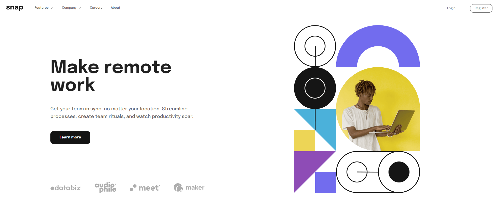

# Frontend Mentor - Intro section with dropdown navigation solution

This is a solution to the [Intro section with dropdown navigation challenge on Frontend Mentor](https://www.frontendmentor.io/challenges/intro-section-with-dropdown-navigation-ryaPetHE5). Frontend Mentor challenges help you improve your coding skills by building realistic projects.

## Table of contents

- [Overview](#overview)
  - [The challenge](#the-challenge)
  - [Screenshot](#screenshot)
  - [Links](#links)
- [My process](#my-process)
  - [Built with](#built-with)
  - [What I learned](#what-i-learned)
  - [Useful resources](#useful-resources)
- [Author](#author)

## Overview

### The challenge

Users should be able to:

- View the relevant dropdown menus on desktop and mobile when interacting with the navigation links
- View the optimal layout for the content depending on their device's screen size
- See hover states for all interactive elements on the page

### Screenshot



### Links

- Live Site URL: [Add live site URL here](https://your-live-site-url.com)

## My process

### Built with

- Semantic HTML5 markup
- Mobile-first workflow
- [React](https://reactjs.org/) - JS library
- [Strapi](https://strapi.io/) - Headless CMS
- [MUI](https://mui.com/) - For styles

### What I learned

This was my first time using Strapi so I wanted to try it out with a very simple page. The backend was automated for the most part, tho I needed to populate some attributes from the API.

```js
const entity = await strapi.entityService.findMany('api::home.home', {
  ...query,
  populate: {
    menu: {
      populate: {
        logo: true,
        menuIcon: true,
        closeMenuIcon: true,
        links: {
          populate: {
            icon: true,
          },
        },
      },
    },
    clients: true,
    imageDesktop: true,
    imageMobile: true,
    cta: true,
  },
})
```

### Useful resources

- [Strapi - How to deploy Heroku app](https://docs.strapi.io/developer-docs/latest/setup-deployment-guides/deployment/hosting-guides/heroku.html#_10-commit-your-changes)
- [Deploying a React app to Vercel](https://www.youtube.com/watch?v=PJRY-J79Yzw&ab_channel=CodeWizard)

## Author

- Website - [Juan Hamilton](https://github.com/hamilton-i7)
- Frontend Mentor - [@hamilton-i7](https://www.frontendmentor.io/profile/hamilton-i7)
